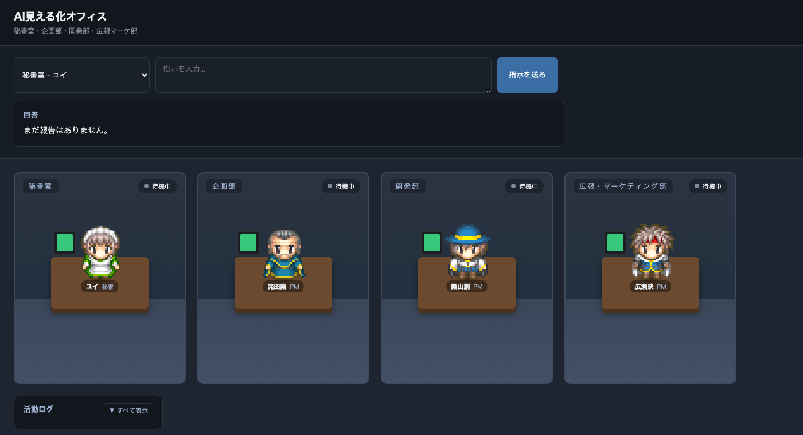

# AI見える化オフィス

Claude Codeのエージェント活動を、2Dドット絵の「社員」としてリアルタイムに可視化する
仕組みです。社長（あなた）→ 部署のPM → その部下（サブエージェント）という会社組織を
模していて、それぞれに名前・人格（SOUL）を持たせています。



## できること

- ブラウザの小さなオフィス画面で、各部署のPMが「待機中・検討中・作業中・報告中」を
  リアルタイムでアニメーション表示
- PMが部下（サブエージェント）を呼び出すと、その部下も小さいキャラクターとして
  一時的に登場する
- ブラウザの指示ボックスから各キャラに指示できる。同じキャラへの指示は同じ記憶
  （セッション）を引き継ぐ
- 「秘書」役が複数部署に横断で相談し、1つの統合報告としてまとめてくれる（部署間連携）
- 各キャラクターに`souls/*.md`で人格（口調・性格・クセ）を持たせられる
- 画面右上の「⚙ 設定」から、エージェントの追加・削除、名前・見た目・人格の編集、
  関係性（部下・相談先）、作業対象プロジェクトの割り当てができる

## 同梱されているサンプル

このテンプレートには、実際に動く例として以下のキャラクターが最初から入っています。
名前や人格は自由に書き換えて構いません。

| 表示名 | 役割 | ソウルファイル |
|---|---|---|
| ユイ | 秘書室（部署横断の相談・統合報告） | `souls/ユイ.md` |
| 発田案（はった あん） | 企画部PM | `souls/発田案.md` |
| 築山創（つきやま そう） | 開発部PM | `souls/築山創.md` |
| 広瀬映（ひろせ えい） | 広報・マーケティング部PM | `souls/広瀬映.md` |
| 明石要 / 設楽構 / 織田創 / 見城評 / 精田照 / 試崎験 | 開発部の部下（要件定義・設計・実装・企画書レビュー・コードレビュー・テスト） | `souls/*.md` |

## 必要なもの

- Python 3
- [Claude Code](https://claude.com/product/claude-code) CLI（`claude`コマンドが使えること。ログイン済みであること）
- 動作確認用にモダンブラウザ（Chrome等）

## 使い方

Windows:

```bash
start_viewer.bat
```

macOS / Linux:

```bash
./start_viewer.sh
```

表示されるURL（`http://localhost:8420/viewer/`）をブラウザで開いてください。
指示ボックスから、宛先を選んで指示を送れます。

初回起動時に、環境に合わせて次の2つが自動で用意されます。どちらもGitの追跡外なので、
書き換えても配布物には影響しません。

- `config/office.json` — あなたのオフィス構成。`config/office.example.json`から複製されます
- `.claude/settings.local.json` — フックの登録。インタプリタとリポジトリの場所を
  絶対パスで書き出すので、`python`か`python3`かを気にする必要はありません

`server.py`は自分自身のファイルが更新されると自動的に再起動します（`state/`や
`souls/`・`prompts/`の変更は元々リクエストごとに読み直すので再起動不要です）。
一度起動したら、`server.py`を編集してもkill/restartする必要はありません。

**注意**: サーバーは`127.0.0.1`のみでリッスンします（他マシンからはアクセスできません）。
また、指示はAuto権限モード（`--permission-mode auto`）で実行されるため、確認プロンプト
なしで実行されます。破壊的な操作は自動でブロックされますが、内容を理解した上で
使ってください。

## 仕組み（アーキテクチャ）

```
ブラウザ
        │ 指示
        ▼
   server.py ──(headless: claude -p --resume <session>)──▶ 各キャラのセッション
        │                                                        │
        │                                          Claude Codeのフック(PreToolUse等)
        │                                                        │
        ▼                                                        ▼
state/agents.json  ◀──────────────────────────  hooks/update_state.py
        │
        ▼
  viewer/（1秒ごとにポーリングして描画）
```

- `hooks/update_state.py`: Claude Codeのフック（`.claude/settings.local.json`で登録）から
  呼ばれ、「誰が・今どういう状態か」を`state/agents.json`に書き込みます。環境変数
  `AI_MIERUKA_AGENT`でどのキャラのフックかを判別しています。
- `server.py`: ブラウザからの指示を受け取り、該当キャラのセッション（`state/sessions/`）
  を`claude -p --resume`で継続実行するローカルサーバーです。同じキャラへの指示は
  セッションIDを介して過去の会話を引き継ぎます。自分自身を子プロセスとして起動する
  親子構成になっていて、`server.py`が編集されたら子だけを作り直します。
- `statefile.py`: `state/agents.json`へのロックとアトミック書き込みを担う共有ヘルパーです。
  `server.py`とフックが同じファイルを書くため、排他制御をここに集約しています
  （Unixは`fcntl`、Windowsは`msvcrt`とAPIが違うので、その差もここで吸収します）。
- `config/office.json`: 誰がいて・どんな関係で・どのプロジェクトを担当するかの
  単一の真実源です。`server.py`・フック・`viewer/`の3者ともこれを実行時に読みます。
  中身は各自の設定なので追跡対象からは外し、雛形の`config/office.example.json`
  だけを配布しています。
- `officeconfig.py`: 上記の読み書きと検証を担います。設定画面からの入力がそのまま
  ファイル名や作業ディレクトリになるため、検証はここに集約しています。
- `dirpicker.py`: フォルダ選択ダイアログを開くだけの小さなスクリプトです。ブラウザは
  仕様上、選んだフォルダの絶対パスをページに渡してくれないため、パスの取得は
  サーバー側で行っています（Tkがサーバーを巻き込んで落ちないよう別プロセスです）。
- `viewer/`: `state/agents.json`をポーリングして2Dキャラを描画する静的ページです。
  キャラの一覧は`/api/office`から取得するので、設定を変えると描画も追従します。

## カスタマイズ方法

### 設定画面から変更する（通常はこちら）

画面右上の「⚙ 設定」を開くと、次のものをその場で編集できます。保存すると
`config/office.json`と`souls/*.md`に書き込まれ、オフィスの画面もすぐ更新されます。

- **個人設定**: 名前・部署・役職・キャラクター画像（127種から選べます）
- **プロジェクト**: 担当するディレクトリ。複数持てます。1つ目が作業ディレクトリ
  （`cwd`）になり、2つ目以降は`--add-dir`で渡されて読み書きできます。パスは
  「参照…」ボタンからOSのフォルダ選択ダイアログで選べます
- **関係性**: 呼び出せる部下（サブエージェント）と、直接相談できる相手
- **人格（SOUL）**: `souls/*.md`の内容
- **サブエージェント**: 部下そのものの追加・削除と、名前・説明・使えるツール・
  人格・キャラクター画像の編集（実体は`.claude/agents/*.md`）

関係性と名乗りは、指示のたびにプロンプトへ自動で反映されます。`prompts/*.txt`には
役割の説明だけを書けばよく、部下や部署の一覧を手書きして二重管理する必要はありません。

内部IDだけは作成後に変更できません。`state/sessions/<内部ID>.txt`（会話の記憶）の
保存先に使っているためです。

**注意**: プロジェクトに追加したディレクトリは、`--permission-mode auto`で
確認プロンプトなしに読み書きされます。追加先には注意してください。

### 部下（サブエージェント）をファイルで直接編集する

設定画面の「👥 サブエージェント」で完結しますが、エディタで直接書いても構いません。
`.claude/agents/<名前>.md`が実体です（Claude Codeの標準的なサブエージェント定義）。
frontmatterの`name`/`description`/`tools`と、本文に「人格」と「仕事内容」を書きます。
ここに置けば設定画面の一覧にも自動で出てきます。

ファイル名は設定画面から保存すると常に`name`と一致するように付け直されます。改名時に
中身と食い違ったファイルが残らないようにするためです。

## キャラクター素材のライセンス

`キャラチップ/`および`viewer/assets/characters/`内のドット絵は「ぴぽや」様の
フリー素材を使用しています（商用・非商用問わず利用OK、加工OK、二次配布OK、
クレジット表記不要）。詳細は`viewer/assets/characters/LICENSE_pipoya.txt`を
参照してください。 (https://pipoya.net/sozai/)

## 既知の制限

- 同じキャラに同時に複数の指示を送ると、状態ファイルへの書き込みが競合する可能性が
  あります（ロック処理はしていますが、キューは1件ずつ順番に処理されます）
- ローカル専用です。他人に公開するホスティングは想定していません
